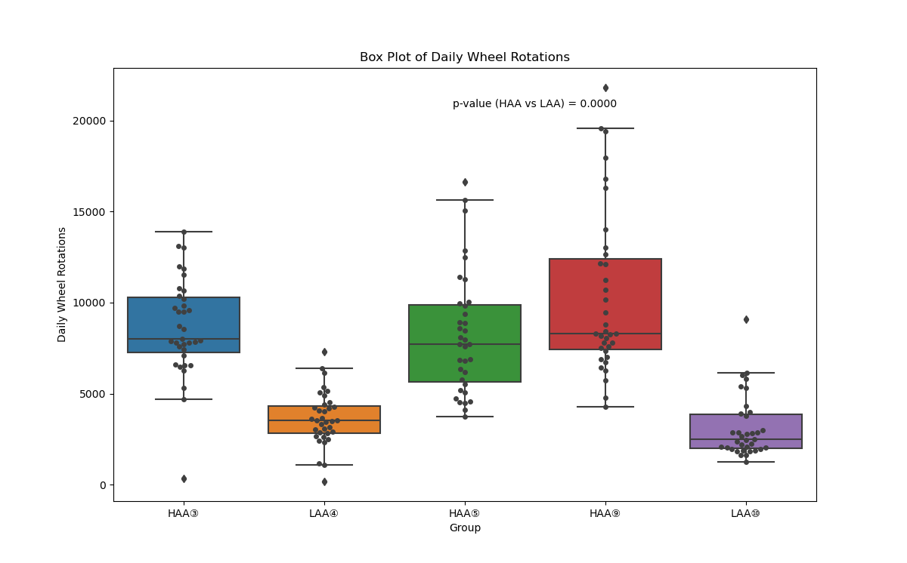
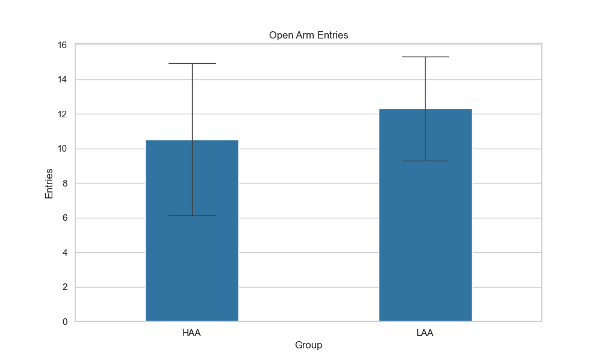

# portfolio

# 自己紹介

明治大学農学部4年生の清水皓平です。以前は11年間、介護職として働いており、その後大学に入学しました。そこで培った対人スキル・問題発見能力を活かし、IT分野へのキャリアチェンジを目指して学んでいます。

現在はPythonを中心にプログラミングを学習しており、個人制作・授業を通して様々なプログラムを作成してきました。

---

# 主な制作・実装例

## 📞 電話帳アプリ（個人制作）
- 電話番号の登録、検索、削除、一覧表示が可能なCLIアプリ
- `pickle` による永続化処理、ファイル存在チェック、数値検証なども実装済み
- CLIでの対話形式で操作可能

## 📊 実験データの統計解析と可視化（研究室）

- ラットの回転運動データを群ごとに集計し、箱ひげ図で可視化
- 群間の違いについて t検定を実施（p-value をグラフ中に表示）
- データフレーム操作・グラフ描画・統計処理をすべてPythonで実施

### 🧪 Daily Wheel Rotations（箱ひげ図）

---

### 🧪 Open Arm Entries（棒グラフ）

## 📂 ファイル操作・処理
- 行番号付きファイル出力
- 2ファイルのマージ・比較出力
- ファイルの内容を交互に出力するプログラム
- コマンドライン引数による処理の制御（`sys.argv`使用）

## 🧪 数学・アルゴリズム
- 素数列挙（エラトステネスのふるい）
- 二次方程式の解の計算（複素数対応）
- ヘロンの公式による三角形面積の計算（関数化）
- 階乗・うるう年判定・割り勘計算などの小規模アルゴリズム多数

## 🔍 テキスト処理・正規表現
- 入力行の正規表現検索・置換
- 姓名の並び替え
- "Good" や特定文字列の検索

---

# スキルセット

- 言語：Python（初級～中級）
- ライブラリ：pandas, matplotlib, seaborn, statsmodels, re, sys
- Git / GitHub を使用したソースコード管理
- 統計解析、データ可視化、CLIツール制作の経験あり

---

# 今後の展望

未経験からのIT業界への挑戦ではありますが、これまで介護現場や大学の研究室で培ってきた「人の話を丁寧に聞く姿勢」「状況を観察して動く力」「チーム内での協力・調整力」を活かし、ユーザーやメンバーと円滑にやり取りができる人材を目指しています。

技術面では今後も学び続け、まずはシンプルなシステムやツールの理解から着実にステップアップしていきたいと考えています。

また、IT職であっても「人と人をつなぐ場面」は多いと感じており、そういったコミュニケーションの部分でも貢献していけることを目標としています。
